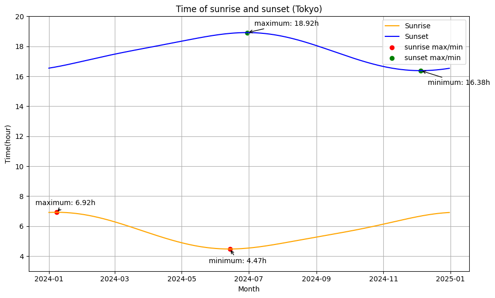

# 本サイトの日の出・日の入り時刻の計算方法

> 最終更新 2024年11月29日

本サイトでは [トップページ](https://kacchan-next.vercel.app/) に、東京の日の出・日の入り時刻の概算値を掲載しています。これはアルゴリズムによって実際に数値計算して得た値です。その計算過程を本ページで紹介します。

:::warning[Warning]

実際の日の出・日の入りの時刻は [国立天文台のサイト](https://eco.mtk.nao.ac.jp/koyomi/dni/) に掲載されています。このサイトでは概算値を計算しているので、実際の値から数分〜10分程度ずれていることがあります。あくまで参考までに。

また、[こちら](https://github.com/random776/kacchan_next/blob/main/src/app/Basic/hinode.tsx)に、実際に計算しているソースコードを掲載しています。

:::

## 赤緯の計算

地球は太陽の周りを楕円運動（公転）していますが、地球の自転軸が傾いているため、自転面は公転面に対して23.4度（0.408ラジアン）程度傾いています。これによって太陽光線と地球赤道面とのなす角が約1年周期で変化するため、日本では四季が生じます。この角度を赤緯 $\delta$ で表します。$\delta \hspace{3pt}\rm{[rad]}$ は正弦関数で表すことができ、

$$
 \delta = -0.408 \cos \left(2 \pi \left(x + 0.025 \right)\right)
$$

とここでは計算しています。ただし、$x$は、1月1日を0、12月31日を1として1年のうちの経過率を0から1で表したものです。

## 太陽が見える時間の計算

『一般気象学』（小倉、1999）によると、$h = 15° \times $(地方時 - 12時間) と定義すると（地球は1時間に15° (0.26ラジアン）公転することに注意）、緯度 $\phi$ として、日の出・日の入り時の $h = h_0$ について

$$
    \cos h_0 = - \tan \phi \tan \delta
$$

と表せます。$h_0$ は（少なくとも白夜や極夜のある極域以外では）$-\pi \le h \le \pi$ で2つあるので、小さい方が日の出、大きい方が日の入りと対応する。こうして日の出から日の入りまでの時間数を求めることができます。

:::warning[訂正]

> 更新 2024年11月29日

「実際この式を適用したところうまくいかず、このサイトでは、

$$
    \cos h_0 = - \frac{\tan \delta}{\tan \phi}
$$

としたところ整合性が取れたのでこちらを採用しています。」と書いたのですが、**参考文献に書いてある上の式で整合性が取れました**。お詫びの上訂正します（それで困る人はほとんどいないだろうが）。

:::

## 近時差などの考慮

仮に日の出から日の入りまでの時間数が$t$であるとして、南中時刻が正午であった場合、日の出時刻 $t_1$ 、日の入り時刻 $t_2$ は、

$$
    t_1 = 12 - \frac{t}{2} \hspace{20pt} t_2 = 12 + \frac{t}{2}
$$

と求められます。しかし、日本標準時の基準は東経135度であり、東京（東経140度）とは少しずれるので南中時刻も20分くらいずれます。また、地球軌道は厳密には楕円軌道なので、太陽の南中時刻は日によって変わること（近時差）というものを考える必要があります。均時差の説明は、[こちらの参考資料](https://www.nao.ac.jp/faq/a0107.html) に全て投げます。

:::info[sleep]

この記事を書いた人は途中で手抜きしたまま寝てしまいました。

:::

## グラフに出力する

日の出、日の入り時間を視覚的に捉えられるよう、ChatGPTでPythonに直してもらった上、グラフに表示してもらいました。ソースコードも記しておきます。こちらの [参考資料](https://eco.mtk.nao.ac.jp/koyomi/wiki/C6FCA4CEBDD0C6FEA4EAA4C8C6EEC3E62FC6FCA4CEBDD0C6FEA4EAA4CEB5A8C0E1CAD1B2BD.html) も参照。



<details>
  <summary>ソースコード</summary>
  ``` python title="sunrise.py"
import numpy as np
import matplotlib.pyplot as plt
from datetime import datetime, timedelta
from matplotlib import rcParams

# 日本語フォントの設定
rcParams['font.family'] = 'DejaVu Sans'  # フォントを変更

def calculate_sun_times(year):
    """ 指定した年の各日の日の出・日の入り時刻を計算 """
    start_date = datetime(year, 1, 1)
    end_date = datetime(year, 12, 31)
    days = (end_date - start_date).days + 1

    dates = []
    hinode_times = []
    hinoiri_times = []

    for day in range(days):
        current_date = start_date + timedelta(days=day)
        dates.append(current_date)

        # 日の出・日の入りの計算
        percentage = (day + 1) / days  # 年度の進行度
        delta = -0.408 * np.cos(2 * np.pi * (percentage + 0.025))  # 赤緯
        cosh = (- np.tan(0.623)) * np.tan(delta)  # 太陽高度
        h = (2 * np.arccos(cosh) * 360) / (2 * np.pi * 15)  # 昼の長さ [時間]

        # 近時差補正
        x = 2 * np.pi * (percentage - 81 / 365)
        kinjisa = (9.87 * np.sin(2 * x) - 7.53 * np.cos(x) - 1.5 * np.sin(x)) / 60  # 近時差 [時間]

        # 日の出・日の入り時刻
        hinode = 12 - 1 / 3 - kinjisa - h / 2
        hinoiri = 12 - 1 / 3 - kinjisa + h / 2

        # 保存（時刻をそのまま記録）
        hinode_times.append(hinode)
        hinoiri_times.append(hinoiri)

    return dates, hinode_times, hinoiri_times

def plot_sun_times(year):
    """ 日の出・日の入り時刻をプロット """
    dates, hinode_times, hinoiri_times = calculate_sun_times(year)

    # 最大値・最小値の計算
    max_hinode = max(hinode_times)
    min_hinode = min(hinode_times)
    max_hinoiri = max(hinoiri_times)
    min_hinoiri = min(hinoiri_times)

    max_hinode_date = dates[hinode_times.index(max_hinode)]
    min_hinode_date = dates[hinode_times.index(min_hinode)]
    max_hinoiri_date = dates[hinoiri_times.index(max_hinoiri)]
    min_hinoiri_date = dates[hinoiri_times.index(min_hinoiri)]

    # プロット作成
    plt.figure(figsize=(10, 6))
    plt.plot(dates, hinode_times, label="Sunrise", color="orange")
    plt.plot(dates, hinoiri_times, label="Sunset", color="blue")

    # 最大・最小点のプロット
    plt.scatter([max_hinode_date, min_hinode_date], [max_hinode, min_hinode], color="red", label="sunrise max/min")
    plt.scatter([max_hinoiri_date, min_hinoiri_date], [max_hinoiri, min_hinoiri], color="green", label="sunset max/min")

    # 注釈を追加
    plt.annotate(f"maximum: {max_hinode:.2f}h", (max_hinode_date, max_hinode), xytext=(-30, 10),
                 textcoords="offset points", arrowprops=dict(arrowstyle="->"))
    plt.annotate(f"minimum: {min_hinode:.2f}h", (min_hinode_date, min_hinode), xytext=(-30, -20),
                 textcoords="offset points", arrowprops=dict(arrowstyle="->"))
    plt.annotate(f"maximum: {max_hinoiri:.2f}h", (max_hinoiri_date, max_hinoiri), xytext=(10, 10),
                 textcoords="offset points", arrowprops=dict(arrowstyle="->"))
    plt.annotate(f"minimum: {min_hinoiri:.2f}h", (min_hinoiri_date, min_hinoiri), xytext=(10, -20),
                 textcoords="offset points", arrowprops=dict(arrowstyle="->"))

    # グラフ設定
    plt.title(f"Time of sunrise and sunset (Tokyo)")
    plt.ylim(3, 20)
    plt.xlabel("Month")
    plt.ylabel("Time(hour)")
    plt.legend()
    plt.grid(True)
    plt.tight_layout()
    plt.show()

# 使用例
plot_sun_times(2024)
  ```
</details>


## 参考資料

- 小倉義光(1999).一般気象学（第2版補訂版）. 東京大学出版会.

- 国立天文台. 太陽の南中時刻は日によって変わるの？. [https://www.nao.ac.jp/faq/a0107.html](https://www.nao.ac.jp/faq/a0107.html) .

- 国立天文台. 暦Wiki/日の出入りの季節変化. [https://eco.mtk.nao.ac.jp/koyomi/wiki/C6FCA4CEBDD0C6FEA4EAA4C8C6EEC3E62FC6FCA4CEBDD0C6FEA4EAA4CEB5A8C0E1CAD1B2BD.html](https://eco.mtk.nao.ac.jp/koyomi/wiki/C6FCA4CEBDD0C6FEA4EAA4C8C6EEC3E62FC6FCA4CEBDD0C6FEA4EAA4CEB5A8C0E1CAD1B2BD.html)
