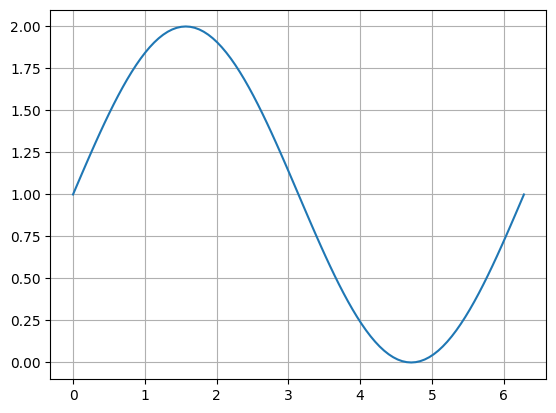
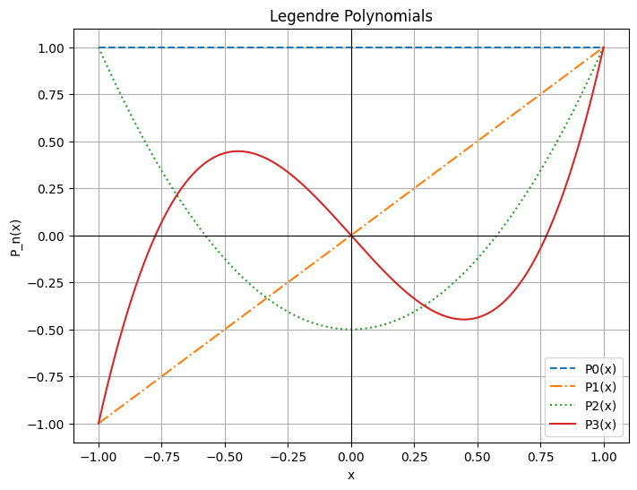

# Python：自分用メモ

> 最終更新：2024 年 11 月 29 日

自分が実験などで解析に使う Python コードをまとめたものです。

## 数値積分

### 実装

台形公式を用いて計算します。

```python title="integral.py"
import numpy as np
import matplotlib.pyplot as plt

data1 = np.linspace(0, 2*np.pi, 101)
data2 = np.sin(data1) + 1

# プロット
fig, ax = plt.subplots()
ax.plot(data1, data2)
ax.grid()
plt.show()

# 数値積分（台形公式）
dif = data1[1] - data1[0]
print("計算値", (np.sum(data2[:-1]) + np.sum(data2[1:])) * dif/2)
print("理論値", np.pi * 2)
```

### 結果



```
計算値 6.283185307179587
理論値 6.283185307179586
```

$$
\int_{0}^{2 \pi} (1 + \sin x) dx = 2 \pi
$$

であり、計算値と理論値とは、$10^{-14}$ 程度のオーダーで一致した。

## 最小二乗法

### 実装

`numpy.polyfit`を使うようです。

```python title="least_squares.py"
import numpy as np
import matplotlib.pyplot as plt

x_axis = [1, 2, 3, 4]
y_axis = [2, 6, 9, 12]

# 最小二乗法による直線当てはめ
slope, intercept = np.polyfit(x_axis, y_axis, 1)

# 回帰直線のy座標を計算
fit_line = np.array(x_axis) * slope + intercept

# プロット
fig, ax = plt.subplots()
ax.plot(x_axis, y_axis, ".", label="Data points")
ax.plot(x_axis, fit_line, "-", label=f"Fit: y = {slope:.2f}x + {intercept:.2f}")
ax.grid()
ax.legend()
plt.show()
```

### 結果

$y = 3.30x - 1.00$ に線形回帰される。


## ルジャンドル多項式

### 実装

`numpy.polynomial.legendre` を使うようです。

```python title="legendre.py"
import numpy as np
import matplotlib.pyplot as plt
from numpy.polynomial.legendre import Legendre

# x軸の範囲を設定
x = np.linspace(-1, 1, 500)

# ルジャンドル多項式を定義
P0 = Legendre([1])               # P0(x)
P1 = Legendre([0, 1])            # P1(x)
P2 = Legendre([0, 0, 1])         # P2(x)
P3 = Legendre([0, 0, 0, 1])      # P3(x)

# グラフを描画
plt.figure(figsize=(8, 6))
plt.plot(x, P0(x), label="P0(x)", linestyle="--")
plt.plot(x, P1(x), label="P1(x)", linestyle="-.")
plt.plot(x, P2(x), label="P2(x)", linestyle=":")
plt.plot(x, P3(x), label="P3(x)")

# グラフの外形を強調
plt.axhline(0, color='black', linewidth=0.8)  # x軸
plt.axvline(0, color='black', linewidth=0.8)  # y軸

# ラベルと凡例
plt.title("Legendre Polynomials")
plt.xlabel("x")
plt.ylabel("P_n(x)")
plt.legend()
plt.grid(True)
plt.show()
```

### 結果

0 次、1 次、2 次、3 次のルジャンドル多項式は

$$
 P_0(x) = 1
$$

$$
P_1(x) = x
$$

$$
P_2(x) = \frac{1}{2}(3x^2 - 1)
$$

$$
P_3(x) = \frac{1}{2}(5x^3 - 3x)
$$

であり、次のように表せる。


