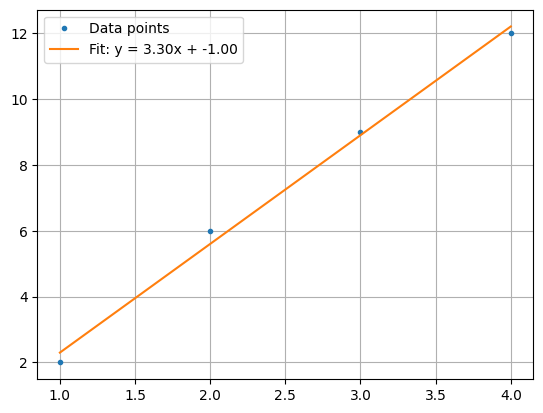

# Python：自分用メモ

自分が実験などで解析に使うPythonコードをまとめたものです。

## 最小二乗法

### 実装

`numpy.polyfit`を使うようです。

``` python title="least_squares.py"
import numpy as np
import matplotlib.pyplot as plt

x_axis = [1, 2, 3, 4]
y_axis = [2, 6, 9, 12]

# 最小二乗法による直線当てはめ
slope, intercept = np.polyfit(x_axis, y_axis, 1)

# 回帰直線のy座標を計算
fit_line = np.array(x_axis) * slope + intercept

# プロット
fig, ax = plt.subplots()
ax.plot(x_axis, y_axis, ".", label="Data points")
ax.plot(x_axis, fit_line, "-", label=f"Fit: y = {slope:.2f}x + {intercept:.2f}")
ax.grid()
ax.legend()
plt.show()
```

### 結果

$y = 3.30x - 1.00$ に線形回帰される。



